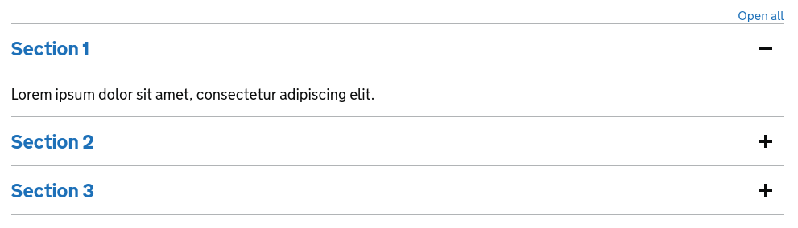

# GOV.UK Components

[](https://github.com/DFE-Digital/govuk-components/actions?query=workflow%3ATests)
[](https://codeclimate.com/github/DFE-Digital/govuk-components/maintainability)
[](https://codeclimate.com/github/DFE-Digital/govuk-components/test_coverage)
[](https://github.com/DFE-Digital/govuk-components/blob/master/LICENSE)
[](https://dependabot.com)
[](https://design-system.service.gov.uk)

This gem provides a suite of reusable components for the [GOV.UK Design System](https://design-system.service.gov.uk/). It is intended to provide a lightweight alternative to the [GOV.UK Publishing Components](https://github.com/alphagov/govuk_publishing_components) library and is built with Github's [ViewComponent](https://github.com/github/view_component) framework.

## What's included

| Component name                                                               | Helper                      |
| --------------                                                               | ------                      |
| [Accordion](app/components/govuk_component/accordion.rb)                     | `govuk_accordion`           |
| [Back link](app/components/govuk_component/back_link.rb)                     | `govuk_back_link`           |
| [Breadcrumbs](app/components/govuk_component/breadcrumbs.rb)                 | `govuk_breadcrumbs`         |
| [Cookie banner](app/components/govuk_component/cookie_banner.rb)             | `govuk_cookie_banner`       |
| [Details](app/components/govuk_component/details.rb)                         | `govuk_details`             |
| [Footer](app/components/govuk_component/footer.rb)                           | `govuk_footer`              |
| [Header](app/components/govuk_component/header.rb)                           | `govuk_header`              |
| [Inset text](app/components/govuk_component/inset_text.rb)                   | `govuk_inset_text`          |
| [Notification banner](app/components/govuk_component/notification_banner.rb) | `govuk_notification_banner` |
| [Panel](app/components/govuk_component/panel.rb)                             | `govuk_panel`               |
| [Phase banner](app/components/govuk_component/phase_banner.rb)               | `govuk_phase_banner`        |
| [Start now button](app/components/govuk_component/start_now_button.rb)       | `govuk_start_now_button`    |
| [Summary list](app/components/govuk_component/summary_list.rb)               | `govuk_summary_list`        |
| [Tabs](app/components/govuk_component/tabs.rb)                               | `govuk_tabs`                |
| [Tag](app/components/govuk_component/tag.rb)                                 | `govuk_tag`                 |
| [Warning text](app/components/govuk_component/warning.rb)                    | `govuk_warning`             |

### Helpers

* `#govuk_link_to`
* `#govuk_mail_to`
* `#govuk_button_to`
* `#govuk_back_to_top_link`
* `#govuk_skip_link`

## Example use

This library allows components to be rendered with Rails' `render` method or via the provided helpers. Here we'll use the `govuk_accordion` to render an accordion.

```erb
<%= govuk_accordion(id: 'def234') do |accordion| %>
  <%= accordion.add_section(title: 'Section 1') do %>
    <p class="govuk-body">Lorem ipsum dolor sit amet, consectetur adipiscing elit.</p>
  <% end %>
  <%= accordion.add_section(title: 'Section 2') do %>
    <p class="govuk-body">Lorem ipsum dolor sit amet, consectetur adipiscing elit.</p>
  <% end %>
  <%= accordion.add_section(title: 'Section 3') do %>
    <p class="govuk-body">Lorem ipsum dolor sit amet, consectetur adipiscing elit.</p>
  <% end %>
<% end %>
```

Here is the rendered accordion.



For examples on usage see the [guide page](https://dfe-digital.github.io/govuk-components/).

## Setup

Add this line to your `config/application.rb`:

```ruby
require "govuk/components"
```

## Installation

Add this line to your application's Gemfile:

```ruby
gem 'govuk-components'
```

And then execute:
```bash
$ bundle
```

Or install it yourself as:
```bash
$ gem install govuk-components
```

## Contributing

To setup the dummy app:

`cd spec/dummy`
`yarn install`
`bundle install`
`bin/rails db:create`
`bin/rails db:migrate`
`bin/rails s`

After changing a component or adding a new one:

* add or update the corresponding specs, and check they pass by running `bundle exec rspec`.

* update the examples page by cd-ing into the dummy app `cd spec/dummy` and running the rake task `bin/rake generate_examples_page`.

## License

The gem is available as open source under the terms of the [MIT License](https://opensource.org/licenses/MIT).
