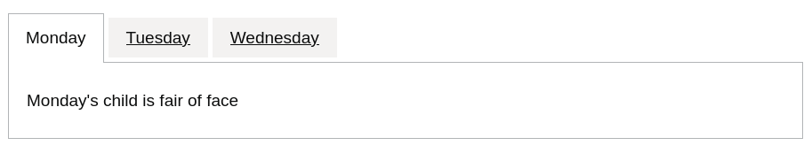

# GOV.UK Components for Ruby on Rails

[](https://github.com/x-govuk/govuk-components/actions?query=workflow%3ATests)
[](https://codeclimate.com/github/x-govuk/govuk-components/maintainability)
[](https://badge.fury.io/rb/govuk-components)
[](https://rubygems.org/gems/govuk-components)
[](https://codeclimate.com/github/x-govuk/govuk-components/test_coverage)
[](https://github.com/x-govuk/govuk-components/blob/main/LICENSE.txt)
[](https://design-system.service.gov.uk)
[](https://viewcomponent.org/)
[](https://weblog.rubyonrails.org/releases/)
[](https://www.ruby-lang.org/en/downloads/)

This gem provides a suite of reusable components for the [GOV.UK Design System](https://design-system.service.gov.uk/). It is intended to provide a lightweight alternative to the [GOV.UK Publishing Components](https://github.com/alphagov/govuk_publishing_components) library and is built with GitHub’s [ViewComponent](https://github.com/github/view_component) framework.

It aims to implement the functionality from the original Nunjucks macros in a way that will feel more familiar to Rails developers. Blocks are preferred over strings of HTML, beneath the surface each component is just a Ruby object, everything is inheritable and overrideable.

## Documentation

The gem comes with [a full guide](https://govuk-components.netlify.app/) that covers most aspects of day-to-day use, along with code and output examples. The examples in the guide (and the guide itself) are built using the components, so it will always be up to date.

[](https://app.netlify.com/sites/govuk-components/deploys)

## What’s included?

All of the non-form components from the GOV.UK Design System are implemented by this library as ViewComponents. Form components are implemented by the [GOV.UK Form Builder](https://govuk-form-builder.netlify.app/).

The provided components are:

* [Accordion](https://govuk-components.netlify.app/components/accordion)
* [Back link](https://govuk-components.netlify.app/components/back-link)
* [Breadcrumbs](https://govuk-components.netlify.app/components/breadcrumbs)
* [Cookie banner](https://govuk-components.netlify.app/components/cookie-banner)
* [Details](https://govuk-components.netlify.app/components/details)
* [Exit this page](https://govuk-components.netlify.app/components/exit-this-page)
* [Footer](https://govuk-components.netlify.app/components/footer)
* [Header](https://govuk-components.netlify.app/components/header)
* [Inset text](https://govuk-components.netlify.app/components/inset-text)
* [Notification banner](https://govuk-components.netlify.app/components/notification-banner)
* [Panel](https://govuk-components.netlify.app/components/panel)
* [Pagination](https://govuk-components.netlify.app/components/pagination)
* [Phase banner](https://govuk-components.netlify.app/components/phase-banner)
* [Section break](https://govuk-components.netlify.app/components/section-break)
* [Start button](https://govuk-components.netlify.app/components/start-button)
* [Summary list](https://govuk-components.netlify.app/components/summary-list)
* [Tabs](https://govuk-components.netlify.app/components/tabs)
* [Tables](https://govuk-components.netlify.app/components/table)
* [Tags](https://govuk-components.netlify.app/components/tag)
* [Warning text](https://govuk-components.netlify.app/components/warning-text)

This library also provides helpers for creating [links](https://govuk-components.netlify.app/helpers/link),
[buttons](https://govuk-components.netlify.app/helpers/button), [skip links](https://govuk-components.netlify.app/helpers/skip-link)
and [back to top links](https://govuk-components.netlify.app/helpers/back-to-top-link).

## Alternative syntax

All of the components can be rendered in two ways:

* directly using Rails’ `#render` method:

  ```erb
    <%= render GovukComponent::WarningTextComponent.new do %>
      A serious warning
    <% end %>
  ```

* via the helper wrapper:

  ```erb
    <%= govuk_warning_text do %>
      A serious warning
    <% end %>
  ```

  The naming convention for helpers is `govuk_` followed by the component’s name in snake case. You can see the full list in [GovukComponentsHelper](app/helpers/govuk_components_helper.rb).

## Example use

This library allows components to be rendered with Rails’ `render` method or via the provided helpers. Here we’ll use the `govuk_tabs` to render three tabbed sections:

```erb
<%= govuk_tabs(title: 'Days of the week') do |component| %>
  <% component.with_tab(label: 'Monday') do %>
    <p>Monday’s child is fair of face</p>
  <% end %>

  <% component.with_tab(label: 'Tuesday') do %>
    <p>Tuesday’s child is full of grace</p>
  <% end %>

  <% component.with_tab(label: 'Wednesday') do %>
    <p>Wednesday’s child is full of woe</p>
  <% end %>
<% end %>
```

Here are the rendered tabs:



For examples on usage see the [guide page](https://govuk-components.netlify.app/).

## Setup

Add this line to your `config/application.rb`:

```ruby
require "govuk/components"
```

## Services using this library

* [Apply for teacher training](https://github.com/DFE-Digital/apply-for-teacher-training)
* [Find postgraduate teacher training](https://github.com/DFE-Digital/find-teacher-training)
* [Get help with technology](https://github.com/DFE-Digital/get-help-with-tech)
* [Publish teacher training courses](https://github.com/DFE-Digital/publish-teacher-training)
* [Register trainee teachers](https://github.com/DFE-Digital/register-trainee-teachers)
* [Teaching Vacancies](https://github.com/DFE-Digital/teaching-vacancies)

## Forks

* [Betagouv Système de Design de l'État view components](https://betagouv.github.io/dsfr-view-components/)

## Installation

Add this line to your application’s Gemfile:

```ruby
gem 'govuk-components'
```

And then execute:

```sh
bundle
```

Or install it yourself as:

```sh
gem install govuk-components
```

## Contributing

Bug reports and feature requests are most welcome, please raise an issue or submit a pull request.

Currently we're using [GOVUK Lint](https://github.com/alphagov/govuk-lint) to ensure code meets the GOV.UK guidelines. Please ensure that any PRs also adhere to this standard.

To help keep the logs clean and tidy, please configure git to use your full name:

```sh
git config --global user.name "Julius Hibbert"
```

## Licence

The gem is available as open source under the terms of the [MIT License](https://opensource.org/licenses/MIT).
